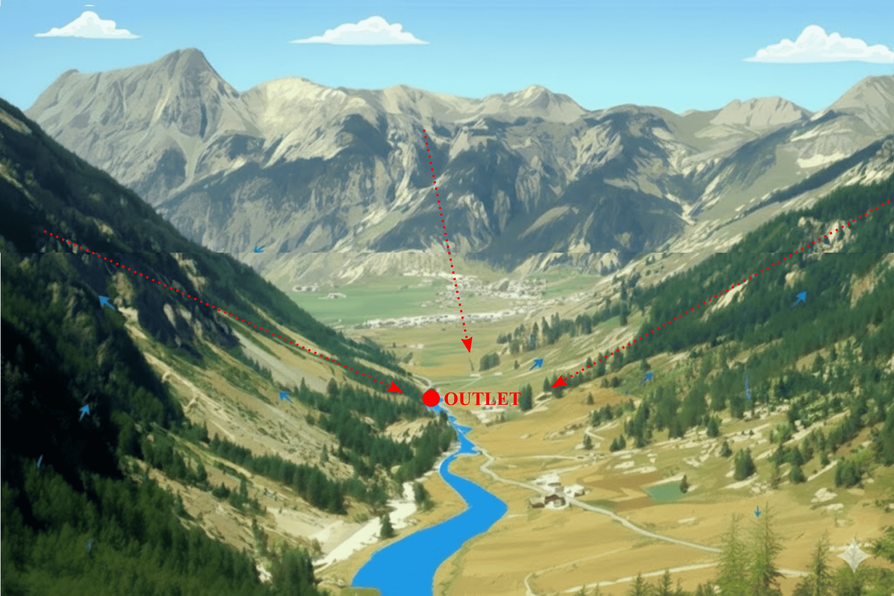
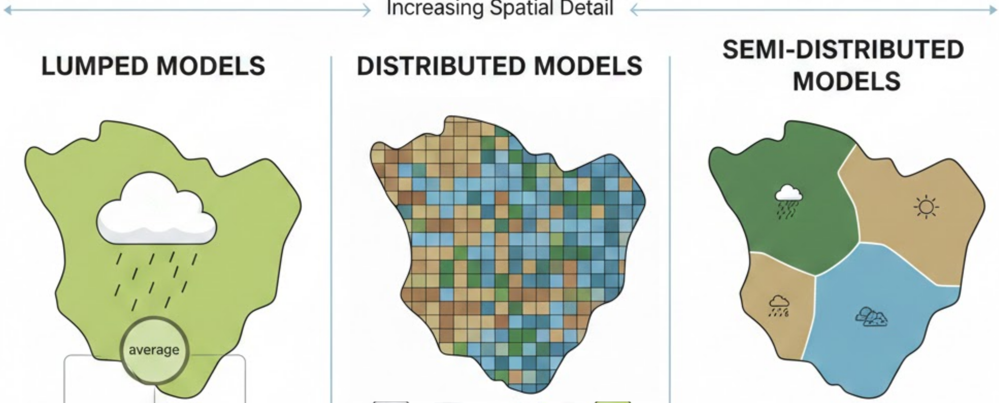
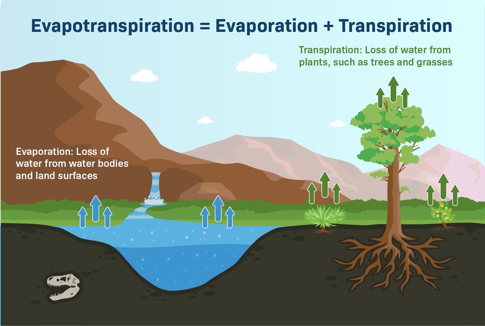

# The watershed concept {#sec-watershed}

A watershed is the fundamental spatial unit used in hydrological modelling.
It is considered hydrologically closed: all precipitation falling within the watershed is partitioned into evapotranspiration, infiltration, and runoff.
Infiltrated water may contribute to subsurface flow and groundwater storage, while all runoff ultimately drains through a single outlet.

{#fig-Rbenefits width=75% fig-alt="Illustration of a watershed"}

# Hydrological Modelling

Hydrological modelling is a core area of hydrology that aims to simulate and understand the complex processes of the water cycle. It relies on simplified representations of these processes to predict the behavior of hydrological systems (watersheds) and assess the impacts of climate change and human activities.

In practice, hydrological modelling uses mathematical models to describe the movement and storage of water within a watershed. These hydrological models are based on the physical laws governing key hydrological processes, such as: precipitation and its partitioning into runoff and infiltration, evapotranspiration, soil infiltration and groundwater flow, surface runoff and its contribution to river discharge.

Hydrological models can be classified based on the **level of process abstraction** and the **spatial discretization** of the watershed. The choice of an hydrological model may depend on the suitability of the model for the specific objectives, the dominant hydrological processes to be represented, the spatial and temporal scales considered, the availability of data, and the computational constraints.

## Classification of hydrological models based on process abstraction

::: {.callout-note}
Depending on the degree of abstraction, models may represent the hydrological cycle through more or less detailed schematizations.
:::

- **Conceptual models**  
  Simplified representations, often based on interconnected reservoirs and empirical or semi-empirical relationships.
- **Physically-based models**  
  Explicitly simulate water transfers and storages using fundamental physical laws applied to the main components of the watershed.

### Classification of hydrological models based on spatial discretization
- **Lumped models**  
  Treat the watershed as a single homogeneous unit, with input variables representing spatial averages of factors affecting hydrological response. 
- **Distributed models**  
  Represent spatial variability in climate forcing, soil properties, topography, and vegetation by discretizing the watershed into interacting grid cells.  
- **Semi-distributed models**  
  Group areas with similar characteristics, balancing process complexity, spatial realism, and computational efficiency.

{#fig-hydro-models width=100% fig-alt="Types of hydrological models"}

# The hydro-climatic modelling workflow

## Hydrologcal model calibration

Hydrological models provide simplified representations of complex watershed behaviour. As a result, they rely on parameters that are typically estimated through calibration, which helps compensate for incomplete process representation and improves the accuracy of simulated streamflow. To ensure that a hydrological model is reliable, it must be both calibrated and evaluated using observational data. Calibration consists of adjusting model parameters to minimize discrepancies between observed and simulated streamflow over a given period. Model evaluation (or validation) then involves running the calibrated model over an independent, “blind” period that was not used during calibration, in order to assess its robustness and predictive performance. Model performance, or goodness of fit, is commonly quantified using statistical criteria such as the Nash-Sutcliffe Efficiency (NSE; @NASH1970282) or the Kling-Gupta Efficiency (KGE; @GUPTA200980).

## Bias correction of climate models

When assessing the impacts of climate change, hydrological models are typically forced using projections from climate models, including [Global](https://www.climatehubs.usda.gov/hubs/northwest/topic/basics-global-climate-models) and [Regional Climate Models (GCMs and RCMs)](https://climatechange.academy/climate-change-assessment-tools/how-regional-climate-models-enhance-predictions/). In this context, the outputs of GCMs developed within Phase 6 of the [Coupled Model Intercomparison Project (CMIP6)](https://wcrp-cmip.org/cmip-phases/cmip6/), which supported the [IPCC Sixth Assessment Report (AR6)](https://www.ipcc.ch/assessment-report/ar6/), provide valuable information for evaluating future climate change impacts. 

However, GCM simulations cannot be used directly as inputs for hydrological models, as they commonly exhibit systematic biases relative to observations. **Bias Correction** is a mandatory step to align climate simulations with local historical observations before running the hydrological model.

::: {.callout-note title="Mechanics of Bias Correction [@Chun2012]"}

Consider a single weather variable (such as daily temperature at a specific grid point) observed over two distinct periods:

- Present-Day Period: Represented by actual observations **$X_o$** and climate model simulations **$X_m$**.
- Future Period: Represented by unknown future observations **$X'_o$** and future climate model projections **$X'_m$**.

The primary goal of a future climate assessment is to estimate the statistical distribution of **$X'_o$** by leveraging the known data samples from **$X_o$**, **$X_m$**, and **$X'_m$**.

The bias correction strategy is built on the fundamental assumption that model errors are **stationary**, meaning they do not change over time. Under this logic, the mathematical relationship required to align the present-day model **$X_m$** with present-day observations **$X_o$** is the exact same relationship needed to align the future model **$X'_m$** with future observations **$X'_o$**.

As shown in @fig-biascorr, this method effectively **"shifts"** or **"reshapes"** the model's output to match the historical reality, then applies that same transformation to future projections. The schematic (a) illustrates the relationship between four key variables: present-day observations (**$X_o$**), present-day model simulations **($X_m$)**, future model projections **($X'_m$)**, and the estimated future observations **($X'_o$)**. The bias correction strategy assumes that model discrepancies (biases) remain stationary over time. As shown in the probability density functions (b), the transformation required to align the present-day model (**$X_m$**, solid blue) with historical observations (**$X_o$**, solid red) is applied to the future model projections (**$X'_m$**, solid purple). This results in the calibrated future projected variable (**$X'_o$**, dashed orange), which inherits the statistical characteristics of the observed distribution while accounting for the model-predicted climate change signal.

![Conceptual framework of the bias correction pathway for climate model projections [@Chun2012].](images/biascorr_illustr.png){#fig-biascorr width=75% fig-alt="Bias correction Illustr"}

:::

# Potential Evapotranspiration (PET)

**PET** is a key hydrological variable representing the water loss from soil and vegetation under the assumption of unlimited water availability (i.e., the atmospheric “evaporative demand”). It quantifies how much water would be evaporated or transpired if there were no water limitations. **PET** is a critical input to conceptual rainfall–runoff models, as it governs soil moisture dynamics and controls the amount of water available for runoff generation. PET can be estimated using various empirical methods, such as **Hargreaves**, **Penman-Monteith**, or **Thornthwaite** formulas, depending on available climate data.

{#fig-pet width=75% fig-alt="Schematic of the PET physics"}

# Practical Objectives of this Module

📌 Calibration and validation of hydrological models

📌 Climate data processing & bias correction

📌 Impact assessment of climate change (scenarios)

📌 Hydrological indicator analysis

📌 Apply all methods in practice using reproducible, open-source tools within the [R environment](https://www.r-project.org/).

# References

::: {#refs}
:::